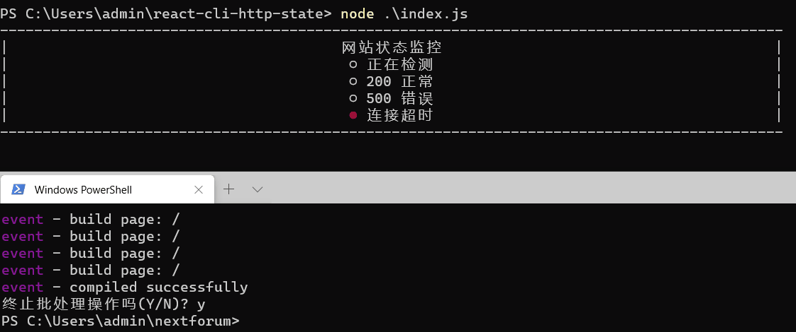

启动：

```
npx babel --watch src --out-dir . --presets react-app/prod 
```

```
node index.js
```

如果出现错误：
```
在此系统上禁止运行脚本。
```
则 win+x 管理员权限的powershell输入：
```
set-ExecutionPolicy RemoteSigned
```

演示：




参考：

1、https://stackoverflow.com/questions/39153080/how-can-i-get-the-status-code-from-an-http-error-in-axios

2、https://reactjs.org/docs/add-react-to-a-website.html#add-jsx-to-a-project